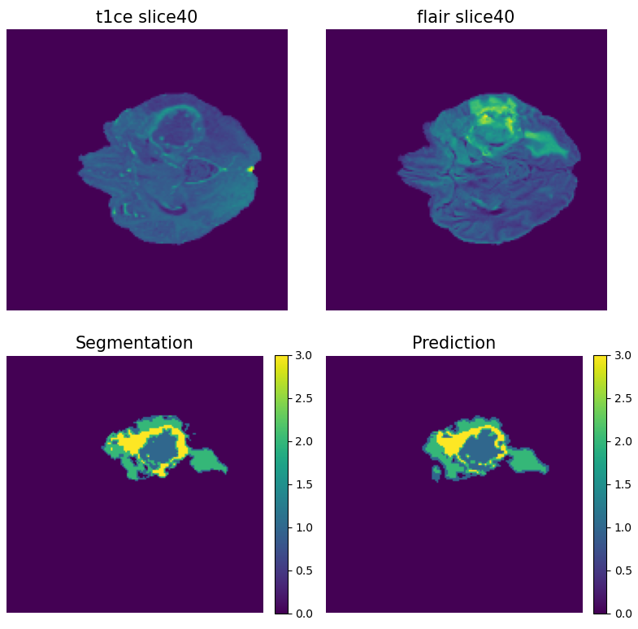

# Brain tumor segmentation using UNET

A pytorch UNET based CNN for brain tumor segmentaiton 

**Environments:**  
environments.yaml

**NN Framework:**  
pytorch

**Scripts:**  
get_data.py: class to generate Pytorch Dataset  
infer.py: run directly from the command line, perform segmentation for MRI scan series  
losses.py: class to define loss type for training the CNN  
model.py: class to generate UNET architecture  
preprocess.py: all auxiliary functions defined to process the data  
train.py: run directly from the command line, train CNN from personalized files/hyperparameters/checkpoints  

**model architecture:**  
The UNET model architecture follows: https://arxiv.org/abs/1505.04597;  
Downsampling to to 512 channels before upsampling to avoid overfitting  
Dropout regularization applied in both encoder and decoder with p=0.2  
Dropout regularization applied in the bottleneck connection with p=0.4

original UNET architecture from https://arxiv.org/abs/1505.04597;  
  

**Infer example:**  

